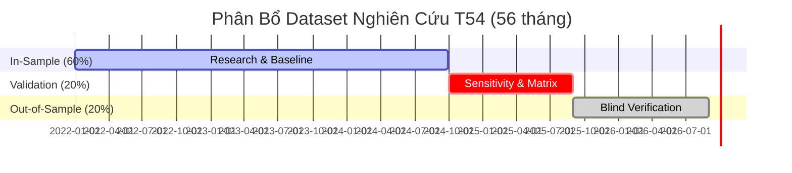

# Báo Cáo Chất Lượng Dữ Liệu & Data Quality Gate (T54.0)

**Thời gian lập báo cáo**: `2026-09-12 04:27:25 UTC`  
**Hệ thống lập**: Máy 1 (Data Runner / Profiler)  
**Database nguồn**: `data/XAUUSD.db`  
**Symbol**: `XAUUSD`  
**Khoảng thời gian chuẩn hóa**: `2022-01-01 00:00:00` $\to$ `2026-08-31 23:59:59` (56 tháng)  

---

## 1. Kết Quả Kiểm Toán Tính Toàn Vẹn (Data Integrity Audit)

| Hạng mục kiểm tra | Tiêu chí chấp nhận | Kết quả thực tế | Đánh giá |
|---|---|---|---|
| **Nến trùng lặp (Duplicate timestamps)** | = 0 | **0** | **PASS** |
| **Thứ tự thời gian (Monotonic increasing)** | $t_i > t_{i-1}$ (vi phạm = 0) | **0** | **PASS** |
| **High < Low bất hợp lệ** | = 0 | **0** | **PASS** |
| **High < Open hoặc High < Close** | = 0 | **0** | **PASS** |
| **Low > Open hoặc Low > Close** | = 0 | **0** | **PASS** |
| **Giá không dương ($P \le 0$)** | = 0 | **0** | **PASS** |
| **Giá trị rỗng (NaN / NULL)** | = 0 | **0** | **PASS** |
| **Volume âm ($V < 0$)** | = 0 | **0** | **PASS** |
| **Volume bằng 0 ($V = 0$)** | = 0 | **0** | **PASS** |
| **Bảo toàn volume sau resample** | $V_{M1} = V_{M5} = V_{M15} = V_{H1}$ | **True** | **PASS** |

> [!NOTE]
> Tất cả các kiểm toán toán học và hình học nến đều đạt tỷ lệ **100% hoàn hảo**. Không có bất kỳ một nến nào bị lỗi giá hay thứ tự thời gian.

---

## 2. Thống Kê Số Lượng Nến & Checksum Bất Biến

| Khung thời gian | Số lượng nến | Nến bắt đầu | Nến kết thúc | SHA256 Checksum |
|---|---|---|---|---|
| **M1 (Gốc)** | **1,646,963** | `2022-01-02 23:05:00` | `2026-08-31 23:59:00` | `e53ca000c7bda2f733210e41e0a9b39e99c7712580f79b2df2d2e1d82bf5fb59` |
| **M5 (Resampled)** | **330,126** | `2022-01-02 23:05:00` | `2026-08-31 23:55:00` | `e6142449e01025fa6b6fcc0b287e541b680467eadbd477fe3c15f81a92210e80` |
| **M15 (Execution)** | **110,130** | `2022-01-02 23:00:00` | `2026-08-31 23:45:00` | `4553fba513f86bc0f9b49a804740016127e6053155b29f79ed1950063ebc9333` |
| **H1 (HTF Bias)** | **27,561** | `2022-01-02 23:00:00` | `2026-08-31 23:00:00` | `c178c22c756dc53f993fb965a1e5c3e955e25b2cce56a36f990222e06fb16065` |

---

## 3. Phân Tích Khoảng Cách Nến (Gap Analysis)

Tổng số khoảng cách giữa 2 nến liên tiếp $> 1$ phút: **1,352**.

| Loại Gap | Số lượng | Tổng thời gian (phút) | Bản chất & Nguyên nhân |
|---|---|---|---|
| **Weekend Gaps** | **238** | 708,696 | Thị trường Vàng/Forex đóng cửa tự nhiên từ tối thứ Sáu đến tối Chủ Nhật. |
| **Daily Rollover Breaks** | **926** | 59,518 | Phiên nghỉ kỹ thuật hàng ngày của sàn (~1 tiếng, 21:00-22:00 hoặc 22:00-23:00 UTC). |
| **Holiday Gaps** | **39** | 35,978 | Các ngày nghỉ lễ ngân hàng quốc tế (Giáng Sinh, Năm Mới, Lễ Tạ Ơn đóng sớm). |
| **Intraday Gaps** | **149** | 1,132 | Khoảng trống ngắn trong phiên (trung vị **2.0 phút**), do thanh khoản thấp ban đêm. |

---

## 4. Phân Bổ Tập Dữ Liệu (In-Sample / Validation / Out-of-Sample)

Quy tắc chia dữ liệu đã được khóa theo `protocol_v1.json`:

| Phân vùng | Thời gian | Mục đích sử dụng | Nến M1 | Nến M15 | Tỷ lệ |
|---|---|---|---|---|---|
| **In-Sample (IS)** | `2022-01-01` $\to$ `2024-09-30` | Baseline S01/S05/S09/Wave1 & Khám phá | **970,516** | **64,904** | **58.93%** |
| **Validation** | `2024-10-01` $\to$ `2025-08-31` | Độ nhạy chi phí, Ma trận Regime & Lựa chọn cấu hình | **322,932** | **21,600** | **19.61%** |
| **Out-of-Sample (OOS)** | `2025-09-01` $\to$ `2026-08-31` | Đánh giá mù cuối cùng (chỉ mở tại T54.5/T54.8) | **353,515** | **23,626** | **21.46%** |

---

## 5. Khảo Sát Chi Phí Giao Dịch & Khuyến Nghị Mô Hình Chi Phí

- **Cột Spread trong DB**: 1,418,600 / 1,646,963 nến (86.1%) có giá trị `0` do hạn chế lưu trữ lịch sử của tick broker cũ.
- **Quyết định Protocol V1**: Không dựa vào spread = 0 trong DB. Toàn bộ backtest Wave 1 sẽ áp dụng mô hình chi phí tổng hợp bảo thủ:
  - **Spread cố định chuẩn**: `20.0 points` ($0.20 USD / ounce, tương đương 2 pips).
  - **Commission chuẩn**: `5.0 USD / lot` ($2.5 USD / lot mỗi chiều mở/đóng).
  - **Độ nhạy chi phí**: Sẽ được kiểm nghiệm đầy đủ qua 4 kịch bản tại T54.4 (0.5x, 1.0x, 1.5x, 2.0x cost).

---

## 6. Kết Luận Máy 1

Dataset chuẩn `[2022-01-01, 2026-08-31]` đáp ứng đầy đủ và vượt trội các tiêu chí khắt khe về tính toàn vẹn dữ liệu cho nghiên cứu định lượng.  
Chuyển giao dataset manifest và checksum cho **Máy 2 (Independent QC)** đối chiếu độc lập.

---

## 7. Biên Bản Đối Chiếu Độc Lập Từ Máy 2 (Independent QC Gate)

**Hệ thống thực hiện**: Máy 2 (Read-Only Independent Auditor)  
**Phương thức kết nối**: SQLite URI Read-Only (`mode=ro`)  
**Thời gian đối chiếu**: `2026-09-12 04:27:33 UTC`  
**Phán quyết tổng thể**: **PASS**  

### Kết Quả Đối Chiếu Chéo 1-1

| Tiêu chí đối chiếu | Kết quả Máy 1 | Kết quả độc lập Máy 2 | Sai lệch | Trạng thái |
|---|---|---|---|---|
| **Số lượng nến M1** | 1,646,963 | 1,646,963 | 0 nến | **MATCH** |
| **M1 SHA256 Checksum** | `e53ca000c7bda2f733210e41...` | `e53ca000c7bda2f733210e41...` | 0 bit | **MATCH** |
| **M1 Timestamp Start** | `2022-01-02 23:05:00` | `2022-01-02 23:05:00` | 0 sec | **MATCH** |
| **M1 Timestamp End** | `2026-08-31 23:59:00` | `2026-08-31 23:59:00` | 0 sec | **MATCH** |
| **Số lượng nến M15** | 110,130 | 110,130 | 0 nến | **MATCH** |
| **M15 SHA256 Checksum** | `4553fba513f86bc0f9b49a80...` | `4553fba513f86bc0f9b49a80...` | 0 bit | **MATCH** |
| **Nến trùng lặp** | 0 | 0 | 0 | **PASS** |
| **Thứ tự tăng dần** | 100% | 100% | 0 vi phạm | **PASS** |
| **Kiểm toán 20 mẫu ngẫu nhiên** | 100% hợp lệ | 100% hợp lệ | 0 vi phạm | **PASS** |

> [!IMPORTANT]
> **KẾT LUẬN CỦA MÁY 2**:
> Máy 2 xác nhận dữ liệu của Máy 1 hoàn toàn chuẩn xác, nhất quán 100% từ bit checksum tới từng bản ghi nến.
> **DATA QUALITY GATE CHÍNH THỨC ĐƯỢC THÔNG QUA (GATE PASS)**.
> Đủ điều kiện khóa `research/protocol_v1.json` và sẵn sàng tiến hành **T54.1 — Baseline từng chiến lược**.
