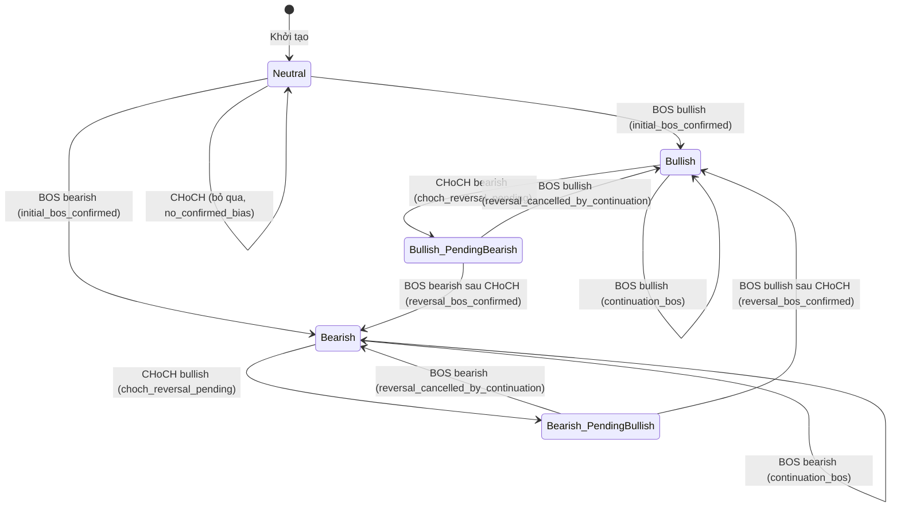
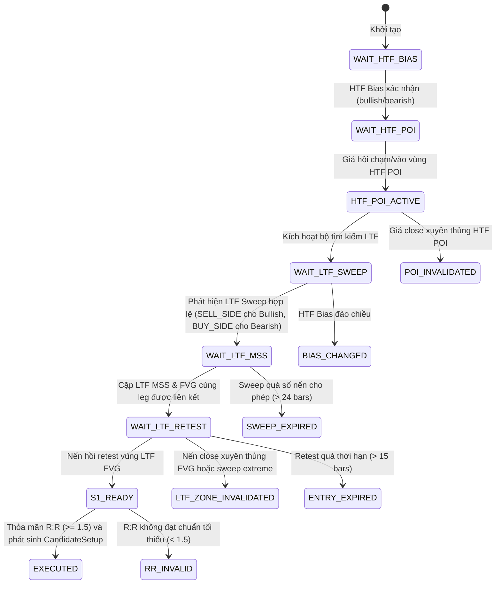

# Walkthrough: Milestones T54–T56 — Visual SMC Replay Inspector, Strategy Research & Supertrend SMC

## 1. Current Implementation Status

Nhiệm vụ **Milestone T54** đã tích hợp bộ công cụ kiểm tra trực quan (**Visual SMC Replay Inspector UI**), mở rộng khả năng chọn vùng thời gian tùy ý (**Custom Date Range & Warm-up Lookback**), và xử lý các nút thắt giới hạn nến. Các milestone tiếp theo bổ sung HTF POI/state machine và chiến lược `smc_st_fvg_mss`.

**Trạng thái hệ thống hiện tại**: **`PARTIAL QC PASS / 4 KNOWN FAILURES`**. Lần chạy lại ngày 2026-09-13 đạt **1.325/1.329 Python tests pass, 4 failures, 2 skipped**. Hai lỗi là legacy snapshot/performance benchmark; hai lỗi còn lại là test registry lịch sử vẫn kỳ vọng 9 strategy trong khi hệ thống hiện có 10 strategy sau khi thêm `smc_st_fvg_mss`. Các test chuyên biệt cho Supertrend đạt **26/26 pass**.

> [!WARNING]
> Các số liệu backtest và test trong những mục có nhãn **Historical** là snapshot tại thời điểm cũ, không được hiểu là kết quả QC hiện tại. Khi code hoặc số lượng strategy thay đổi, phải chạy lại lệnh kiểm thử trước khi cập nhật trạng thái tài liệu.

> [!IMPORTANT]
> Luồng SMC Replay chỉ xác định được HTF Bias và HTF POI khi request có `htf_events` hoặc ContextBuilder được seed sẵn HTF POI. API hiện hỗ trợ nhận `htf_events` tùy chọn; frontend Replay hiện tại chưa tự gửi trường này, vì vậy Replay mở mặc định có thể hiển thị `NEUTRAL` / `WAIT_HTF_BIAS` và chưa tạo S1 candidate. Đây là giới hạn tích hợp dữ liệu đầu vào, không phải lỗi của state machine.

### Kiến trúc Hai Luồng Replay (Dual-Mode Replay)

Frontend `public\app.js` duy trì hai luồng Replay với mục đích **hoàn toàn khác nhau** và cùng tồn tại có chủ ý:

| Controller | API Endpoint | Mục đích | Giới hạn |
|---|---|---|---|
| **`ReplayManager`** | `GET /api/replay/init` | Replay chart thô: người dùng click vào một nến trên chart để cắt tại điểm đó, sau đó tua từng nến về phía trước (visual playback). Không chạy engine SMC, không tính toán strategy. | Default: `history_limit=1000`, `future_limit=1000`; Maximum allowed: `200000` mỗi tham số (`ge=10, le=200000`). |
| **`SMCReplayController`** | `POST /api/replay/timeline` | Replay phân tích SMC: chạy toàn bộ backtest engine, serialize từng bar kèm diagnostic state (HTF bias, OBs, FVGs, candidates, rejections, fills). Phục vụ Visual Inspector sidebar. | Default: `limit=5000`, `max_bars=5000`; Maximum allowed: `200000` (`ge=10, le=200000`). |

> [!NOTE]
> Hai controller **không phải là duplicate và không được hợp nhất làm một**. `SMCReplayController` là luồng **mới chuẩn hóa** được thiết kế cho phân tích SMC đầy đủ, gọn kèm diagnostic state từng nến. `ReplayManager` là luồng **cũ được giữ lại để tương thích** (đã cập nhật giới hạn nến) phục vụ visual playback nến đơn giản, cho phép người dùng tua chart tại bất kỳ thời điểm mà không cần chạy engine SMC.

### Đồng bộ Giới hạn Backend

Hệ thống phân tách rõ hai schema backend tại `D:\tool\backtest\server.py` để tránh nhầm lẫn giữa các luồng:
- **`ReplayTimelineRequest`** (dành riêng cho phân tích Visual Replay Timeline `POST /api/replay/timeline`):
  - `limit: int = Field(5000, ge=10, le=200000)` — mặc định **5.000 nến**, hỗ trợ tối đa **200.000 nến**
  - `max_bars: int = Field(5000, ge=10, le=200000)` — mặc định đưa tối đa **5.000 nến** vào timeline payload, hỗ trợ tối đa **200.000 nến**
  - `warmup_bars: int = Field(500, ge=0, le=20000)` — nến lookback đệm, mặc định **500 nến**, tối đa **20.000 nến**
- **`BacktestRequest`** (dành cho Standard Backtest Engine `POST /api/backtest/run`):
  - `limit: int = Field(2000, ge=10, le=200000)` — mặc định **2.000 nến**, hỗ trợ tối đa **200.000 nến**
  - `warmup_bars: int = Field(500, ge=0, le=20000)` — nến lookback đệm, mặc định **500 nến**, tối đa **20.000 nến**
  - *(Lưu ý: `BacktestRequest` không có trường `max_bars`, chỉ `ReplayTimelineRequest` có trường này)*
- **`ReplayManager`** (`GET /api/replay/init`): Default `history_limit=1000`, `future_limit=1000`; Maximum allowed: `200000` mỗi tham số (`ge=10, le=200000`).

### Warm-up Lookback & Cách Ly Lệnh (Warmup Isolation)

- Tích hợp tham số `warmup_bars` vào `ReplayTimelineRequest`, `BacktestRequest`, và pipeline điều phối `SMCBacktestCoordinator`.
- Trong các nến đệm warm-up (`idx < start_i`), hệ thống cập nhật đầy đủ bối cảnh SMC (HTF bias, active OBs/FVGs, Swings, Liquidity Pools), nhưng **tự động xóa và ngắt mọi pending intent / position state** tại mốc ranh giới `start_i - 1`. Đảm bảo **tuyệt đối không tạo hay khớp lệnh trước `analysis_start`**.

### Hạ tầng Replay & Engine

- API `/api/replay/timeline` kết nối trực tiếp với `HTFTimeline` và `SMCBacktestCoordinator` tại `D:\tool\backtest\smc\engine\backtest_adapter.py`.
- Đảm bảo 100% nguyên tắc Zero Future Lookahead, khớp giá chính xác theo spread/commission, phân loại lỗi theo chuẩn **22 mã Diagnostic Taxonomy**.
- Mỗi bar trong timeline được gắn flag minh bạch: `is_warmup`, `is_analysis`, `is_displayed`.
- HTF POI được lấy từ POI được truyền trực tiếp hoặc được `HTFPOITracker` seed từ các HTF BOS event; hệ thống chưa tự resample dữ liệu HTF độc lập trong frontend Replay.

### Giao diện Visual Replay Inspector UI

Hỗ trợ hiển thị trực quan các cấu trúc SMC trên biểu đồ (`public\smc_renderer.js` & `public\app.js`):
- Nến OHLC M15 và điểm nhấn nến replay hiện tại.
- Vùng HTF bias H1 và các điểm HTF Swing High/Low.
- LTF Structure events (BOS, CHoCH / MSS).
- Vùng Order Block (OB) và Fair Value Gap (FVG) kèm trạng thái active/mitigated.
- Candidate Setup Cards hiển thị điểm Entry, SL, TP dự kiến hoặc lý do bị loại bỏ (Diagnostic Code).
- Execution Markers (Buy/Sell fill, Win/Loss outcome).

### Chiến lược Supertrend SMC mới (`smc_st_fvg_mss`)

Hệ thống hiện đã có chiến lược độc lập theo chuỗi:

```text
HTF Supertrend
  → HTF FVG cùng hướng
    → Giá hồi vào HTF FVG
      → LTF Liquidity Sweep
        → LTF MSS đồng pha
          → LTF FVG hình thành sau MSS
            → Retest CE50/proximal
              → SL ngoài vùng sweep
                → TP cố định 3R
```

Module chính:
- `smc/indicators/supertrend.py`: tính Supertrend và trạng thái HTF.
- `smc/context/htf_supertrend_fvg.py`: theo dõi HTF bias, HTF FVG và expiry/invalidation.
- `smc/engine/strategies/smc_supertrend_fvg_mss.py`: state machine và CandidateSetup.
- `tests/test_smc_supertrend.py`, `tests/test_smc_supertrend_fvg_mss.py`: kiểm thử chỉ báo và chiến lược.

Cấu hình baseline: HTF `H1`, LTF `M5`, ATR length `10`, multiplier `3`, xác nhận Supertrend tối thiểu `2` nến HTF, sweep→MSS tối đa `8` nến LTF, MSS→entry tối đa `15` nến LTF, entry mặc định tại `CE50`, SL buffer `0.2 × ATR LTF`, TP `3R`. Chiến lược dùng nến đã đóng và không sử dụng dữ liệu tương lai.

---

## 2. Dynamic Range Definitions & Warm-up Isolation Architecture

Hệ thống phân định rõ ràng các mốc thời gian và chỉ số nến trong quá trình tính toán và hiển thị Replay/Backtest:

```text
 ┌───────────────────────┬─────────────────────────────────────────────┐
 │   Warm-up Range       │             Analysis Range                  │
 │ (Build Context Only)  │       (Trade Evaluation & Execution)        │
 ├───────────────────────┼─────────────────────────────────────────────┤
 ▲                       ▲                                             ▲
 │                       │                                             │
 warmup_start         analysis_start                               analysis_end
 (start_time - warmup) (start_time / start_bar_index)              (end_time)
                         ▲
                         │
                      display_start (Viewport start on Chart UI)
```

### Các Khái Niệm Ranh Giới:
1. **`analysis_start`**: Mốc thời gian / bar index bắt đầu đánh giá chiến lược và cho phép phát sinh tín hiệu giao dịch.
2. **`analysis_end`**: Mốc thời gian / bar index kết thúc khoảng phân tích giao dịch.
3. **`warmup_start`**: Mốc thời gian lùi về quá khứ (`start_time - warmup_bars`) để nạp nến đệm lịch sử.
4. **`display_start`**: Bar index bắt đầu render viewport trên biểu đồ frontend (có thể tùy chỉnh độc lập với `warmup_start`).
5. **Phân tách số nến tính toán vs hiển thị**:
   - Số nến tính toán = `warmup_count` + `analysis_count` (ví dụ: 500 nến warm-up + 50.000 nến phân tích = 50.500 nến).
   - Số nến render UI có thể cắt gọn theo `display_start` và `max_bars` để tối ưu hiệu năng hiển thị canvas TradingView.
6. **Quy tắc Zero-Trade Trước `analysis_start`**:
   - Tất cả các nến thuộc khoảng `[warmup_start, analysis_start)` đi qua pipeline để tính toán Swings, OBs, FVGs và HTF Bias.
   - Tại mốc nến ngay trước `analysis_start` (`start_i - 1`), bộ điều phối `SMCBacktestCoordinator` tiến hành **reset `ExecutionKernel`**, xóa sạch `pending_intent`, `trades`, `markers` và `equity_curve` lịch sử đệm.
   - Kết quả: Toàn bộ lệnh giao dịch thực tế chỉ phát sinh và tính PnL từ nến `analysis_start` trở đi.

---

## 3. Current Strategy Presets & Runtime Configuration

Trong bộ điều phối `SMCBacktestCoordinator` tại [backtest_adapter.py](D:\tool\backtest\smc\engine\backtest_adapter.py), các chiến lược SMC được khởi tạo với cấu hình tùy chỉnh thực tế như sau:

```python
strat_list = [
    S01ICT2022Strategy(
        S01Config(require_displacement=False, sweep_to_mss_max_bars=24)
    ),
    S05BOSOBRetestStrategy(
        S05Config(
            require_displacement=False,
            max_ob_age_bars=75,
            min_rr=1.0,
            fallback_rr=2.0,
        )
    ),
    S09ICTSilverBulletStrategy(
        S09Config(use_time_filter=False, require_displacement=False)
    ),
]
```

### Cơ chế truyền tham số, Cooldown và cấu hình Wave1:
1. **Thời gian Cooldown mặc định vs Cooldown thực nghiệm**:
   - Runtime mặc định của `SMCBacktestCoordinator` chạy với **`cooldown_bars = 3`** (khóa phát sinh tín hiệu mới cùng hướng trong vòng 3 nến sau khi khớp lệnh).
   - Ngược lại, thử nghiệm cực đại trong [smc_max_orders_10000.json](D:\tool\backtest\research\runs\smc_max_orders_10000.json) được thiết lập với **`cooldown_bars = 0`** và `min_rr = 1.0`. Do đó, số liệu max-orders là kết quả ranh giới nghiên cứu lý thuyết, không phải là trạng thái runtime mặc định.
2. **Cấu hình S01 Runtime & Cửa Sổ 24 Nến**:
   - Runtime hiện tại của S01 áp dụng **`sweep_to_mss_max_bars = 24`** và **`s01_stale_sweep_max_bars = 24`** (được nới từ ngưỡng 20 bars ban đầu) để bao quát đầy đủ cấu trúc hình thành sau thanh khoản.
   - **Feature thử nghiệm `s01_allow_mss_without_sweep`**: Dataclass `S01Config` hỗ trợ cờ `allow_mss_without_sweep: bool = False`. Trong chế độ adaptive thử nghiệm này, một MSS cùng hướng HTF bias có thể tạo candidate setup mà không cần nến liquidity sweep trước đó. Tuy nhiên, kết quả thử nghiệm thực tế cho thấy cấu hình này chỉ đạt **33.33% win rate, Profit Factor 0.50, PnL -$22.38** (xem Bảng 4.1), do đó được đánh dấu là **tính năng thử nghiệm opt-in**, mặc định là `False`, **chưa phải là runtime mặc định**.
3. **Trạng Thái Chiến Lược S05 (Active Runtime vs. Opt-in Logic)**:
   - **Active Runtime Hiện Tại**: S05 đang hoạt động với **logic cũ (Legacy BOS $\to$ OB first retest)**: Khi xuất hiện BOS, xác định Order Block nguồn gốc và đợi nến giá hồi retest lần đầu tiên vào OB (`require_ltf_confirmation=False`, `max_ob_age_bars=75`, `min_rr=1.0`).
   - **Opt-in Logic (Chưa kích hoạt trong default runtime)**: Logic cải tiến theo chuỗi ICT Top-Down:
     ```text
     HTF Bias → HTF OB cùng hướng bias → Giá chạm HTF OB → LTF MSS/CHoCH cùng hướng → LTF FVG/OB retest → Candidate
     ```
Hiện tại cấu hình này đã **được implement dạng opt-in nhưng chưa bật trong default runtime** (mặc định `require_ltf_confirmation=False` để bảo đảm độ ổn định của hệ thống).
4. **LTF Structure Mode Wiring**: Trong [backtest_engine.py](D:\tool\backtest\engine\backtest_engine.py), `ContextBuilderConfig` được khởi tạo đọc tham số từ runner hoặc API:
   ```python
   ctx_cfg = ContextBuilderConfig(
       timeframe=timeframe,
       structure_mode=strategy_params.get("s09_mode", "internal"),
   )
   ```
   Wave1 adapter sử dụng `structure_mode="internal"` để đồng bộ LTF ContextBuilder với các chiến lược SMC. Nếu `ContextBuilderConfig` được gọi độc lập bên ngoài Wave1 mà không chỉ định `structure_mode`, giá trị mặc định của nó vẫn là `"swing"`.
5. **Cấu hình S09 Time Filter**: Cấu hình mặc định trong dataclass [s09_ict_silver_bullet.py](D:\tool\backtest\smc\engine\strategies\s09_ict_silver_bullet.py) vẫn giữ `use_time_filter=True` và bộ giờ phiên canonical (London 03:00-04:00, NY AM 10:00-11:00, NY PM 14:00-15:00 NY time). Tuy nhiên, trong runtime hiện tại của coordinator, `use_time_filter=False` được áp dụng để đánh giá năng lực tạo candidate của S09 trên toàn bộ 24h giao dịch.
6. **Cơ chế Override Tham Số**: Tại [backtest_engine.py](D:\tool\backtest\engine\backtest_engine.py) (dòng 535–599), khi `strategy_params` chứa các khóa đè (`s01_require_displacement`, `s01_sweep_to_mss_max_bars`, `s01_stale_sweep_max_bars`, `s01_allow_mss_without_sweep`, `s05_max_ob_age_bars`, `s09_use_time_filter`, ...), engine sẽ tự động khởi tạo lại các instance chiến lược tương ứng với cấu hình đè từ runner.

### Bảng 3.1: Current Runtime Configuration

| Strategy | Active configuration | Cooldown | Time filter | Displacement | RR | OB/FVG limits & Gating |
|---|---|:---:|:---:|:---:|:---:|---|
| **S01 (Active)** | `S01Config(require_displacement=False)` | **3 bars** | **N/A** | **False** | `min_rr=1.5` (fallback 2.0) | `sweep_to_mss_max_bars=24`, `s01_stale_sweep_max_bars=24`, `fvg_to_mss_max_bars=10`, `entry_expiry_bars=15` (Opt-in: `allow_mss_without_sweep=False`) |
| **S05 (Active)** | `S05Config(require_displacement=False, max_ob_age_bars=75, min_rr=1.0)` | **3 bars** | **N/A** | **False** | `min_rr=1.0` (fallback 2.0) | `max_ob_age_bars=75`, `min_ob_quality="base"` (Legacy BOS $\to$ OB first retest; LTF confirmation=False mặc định) |
| **S09 (Active)** | `S09Config(use_time_filter=False, require_displacement=False)` | **3 bars** | **False** (bật lại được) | **False** | `min_rr=1.5` (fallback 2.0) | `fvg_to_mss_max_bars=10`, `grace_minutes=15` |

---

## 4. Latest Backtest Results & Condition Relaxation Matrix

Các số liệu thực nghiệm trong hệ thống gồm hai tầng dữ liệu cần phân biệt rõ:
1. **Dữ liệu nghiên cứu điều kiện nới lỏng (Historical Artifacts T54.1)**: Trích xuất từ 4 tập tin JSON artifact tại [research/runs/](D:\tool\backtest\research\runs) trên tập In-Sample 10.000 nến M15 XAU/USD (`2022-01-02 23:00:00` đến `2022-06-06 07:30:00`, vốn $10.000, lot 0.01, spread 20 pts, commission $5/lot).
   > [!WARNING]
   > Tập tin [t54_1_baseline_s01_10000.json](D:\tool\backtest\research\runs\t54_1_baseline_s01_10000.json) là **artifact lịch sử** từ commit trước đó, ghi nhận biến thể S01 ban đầu (`require_displacement=True`, sinh 2 trades, win rate 50%). Nó không đại diện cho runtime coordinator hiện tại.
2. **Dữ liệu Runtime Coordinator Hiện Tại (Active S01 Pipeline)**:
   - Cấu hình thực tế: `S01Config(require_displacement=False)`, `sweep_to_mss_max_bars=24`, `s01_stale_sweep_max_bars=24`, `cooldown_bars=3`.
   - Kết quả trên tập mẫu chuẩn 10.000 nến M15 XAU/USD (`2022-01-01` đến `2024-09-30`):
     - **Sweeps**: 204 SELL_SIDE, 180 BUY_SIDE
     - **Valid MSS**: 40 | **Linked FVG**: 40
     - **Candidates**: 16 | **Eligible**: 12 | **Fills**: 8 | **Trades**: 8
     - **Wins**: 3 | **Losses**: 5 | **Win Rate**: **37.50%**
     - **Net PnL**: **+$13.40** | **Profit Factor**: **1.47** | **Max Drawdown**: **$19.15 (0.19%)**

- [t54_1_baseline_summary_10000.json](D:\tool\backtest\research\runs\t54_1_baseline_summary_10000.json)
- [s01_s05_condition_matrix_10000.json](D:\tool\backtest\research\runs\s01_s05_condition_matrix_10000.json)
- [s09_condition_matrix_10000.json](D:\tool\backtest\research\runs\s09_condition_matrix_10000.json)
- [smc_max_orders_10000.json](D:\tool\backtest\research\runs\smc_max_orders_10000.json)

### Bảng 4.1: Condition Matrix Nghiên Cứu vs. Runtime Hiện Tại (10.000 Nến M15)

| Strategy | Variant | Candidates | Trades | Wins | Losses | Win rate | Net PnL ($) | Profit Factor | Max DD ($ / %) | First zero layer |
| :--- | :--- |---:|---:|---:|---:|---:|---:|---:|---:| :--- |
| **S01 (Runtime)** | **Active Coordinator (`require_displacement=False`, window=24, cooldown=3)** | **16** | **8** | **3** | **5** | **37.50%** | **+$13.40** | **1.47** | **$19.15 / 0.19%** | None |
| **S01 (Adaptive Exp)** | Thử nghiệm Adaptive (`allow_mss_without_sweep=True`, opt-in) | 18 | 9 | 3 | 6 | 33.33% | -$22.38 | 0.50 | $26.73 / 0.27% | Opt-in experimental (chưa phải runtime mặc định) |
| **S01 (T54.1 Hist)** | Baseline cũ (`require_displacement=True`, cooldown=3) | 3 | 2 | 1 | 1 | 50.0% | +$8.41 | 2.04 | $14.33 / 0.14% | None |
| | Bỏ displacement (`no_displacement`, cooldown=3) | 19 | 8 | 3 | 5 | 37.5% | +$11.23 | 1.37 | $19.15 / 0.19% | None |
| | Nới FVG/expiry (`no_disp_fvg20_expiry30`, cooldown=3) | 21 | 8 | 3 | 5 | 37.5% | +$11.23 | 1.37 | $19.15 / 0.19% | None |
| | Nới FVG/expiry/RR (`no_disp_fvg30_expiry50_rr1`, cooldown=3) | 21 | 7 | 2 | 5 | 28.57% | -$5.25 | 0.83 | $26.73 / 0.27% | None |
| | Cấu hình cực đại (`smc_max_orders`, cooldown=0, RR 1.0) | 31 | 7 | 1 | 6 | 14.29% | -$23.02 | 0.27 | $36.36 / 0.36% | None |
| **S05 (Runtime)** | **Active Runtime: BOS $\to$ OB Retest (`no_displacement`, age=75, rr=1.0)** | **108** | **62** | **14** | **48** | **22.58%** | **+$41.69** | **1.31** | **$43.00 / 0.43%** | None |
| **S05 (Opt-in)** | HTF OB touch $\to$ LTF Confirmation $\to$ Retest | - | - | - | - | - | - | - | - | Implemented opt-in; chưa bật trong default runtime |
| | Baseline cũ (`require_displacement=True`, cooldown=3) | 19 | 16 | 3 | 13 | 18.75% | +$22.24 | 1.91 | $16.86 / 0.17% | None |
| | Bỏ displacement (`no_displacement`, cooldown=3) | 107 | 67 | 15 | 52 | 22.39% | +$28.08 | 1.19 | $50.26 / 0.50% | None |
| | Bỏ displacement + OB age 50 (`no_disp_ob_age50`, cooldown=3) | 108 | 68 | 15 | 53 | 22.06% | +$25.61 | 1.17 | $52.73 / 0.52% | None |
| | Cấu hình cực đại (`smc_max_orders`, cooldown=0, RR 1.0) | 108 | 72 | 18 | 54 | 25.0% | +$45.61 | 1.28 | $42.86 / 0.43% | None |
| **S09** | Baseline hiện tại (bỏ giờ phiên, giữ displacement, cooldown=3) | 0 | 0 | 0 | 0 | 0.0% | $0.00 | 0.00 | $0.00 / 0.0% | `candidate_setups` |
| | **Bỏ time filter + displacement (`disable_disp`, cooldown=3)** | **9** | **8** | **2** | **6** | **25.0%** | **-$18.22** | **0.70** | **$64.79 / 0.64%** | None |
| | Bỏ displacement + lag 20 (`disable_disp_lag20`, cooldown=3) | 9 | 8 | 2 | 6 | 25.0% | -$18.22 | 0.70 | $64.79 / 0.64% | None |
| | Bỏ displacement + lag 50 + RR 1.0 (`disable_disp_lag50_rr1`, cooldown=3) | 9 | 6 | 1 | 5 | 16.67% | -$22.75 | 0.52 | $52.84 / 0.53% | None |
| | Cấu hình cực đại (`smc_max_orders`, cooldown=0, RR 1.0) | 9 | 7 | 2 | 5 | 28.57% | -$8.89 | 0.81 | $52.85 / 0.53% | None |

---

## 5. Root Cause Status & S09 Analysis

Dựa trên dữ liệu ma trận điều kiện thực nghiệm, nguyên nhân gốc suppressing candidates của từng chiến lược được xác định như sau:

- **S01 (ICT 2022 Reversal)**:
  - `require_displacement` là nút thắt chính làm giảm số lượng candidate. Khi tắt displacement, số candidate tăng mạnh từ **3 lên 19** setups (+533%), chuyển đổi thành 8 lệnh khớp với PnL dương +$11.23.
  - Nới rộng window FVG/expiry tiếp tục tăng nhẹ candidate lên 21, nhưng khi hạ `min_rr=1.0` hoặc nới cực đại (31 candidates) thì tỷ lệ win rate giảm mạnh (xuống 14.29%) và PnL chuyển sang âm (-$23.02) do nhận các setup chất lượng thấp.

- **S05 (BOS $\to$ OB Retest)**:
  - **Trạng thái logic**: Runtime đang chạy của S05 là **Legacy BOS $\to$ OB first retest** (`require_displacement=False`, `max_ob_age_bars=75`, `min_rr=1.0`). Kiến trúc mới (HTF OB touch $\to$ LTF confirmation $\to$ LTF FVG/OB retest) đã được **implement dạng opt-in** (`require_ltf_confirmation=True`) nhưng **chưa bật trong runtime mặc định**, và được giữ làm biến thể nghiên cứu độc lập.
  - `require_displacement` là bottleneck khống chế số lượng candidate lớn nhất. Khi tắt displacement, candidate nhảy từ **19 lên 107** setups (+463%), tạo ra 67 lệnh khớp.
  - Tuổi của Order Block (`max_ob_age_bars`) chỉ có tác động rất nhỏ: tăng từ 25 lên 50 bars chỉ tạo thêm **1 candidate** (107 $\to$ 108), và tăng lên 75 bars giữ nguyên 108 candidates.
  - Cấu hình nới `no_displacement_ob_age75_rr1` đạt Net Profit cao nhất (+41.69 USD, PF = 1.31) trong nhóm thử nghiệm vừa phải.

- **S09 (ICT Silver Bullet)**:
  - Trong tập tin [s09_condition_matrix_10000.json](D:\tool\backtest\research\runs\s09_condition_matrix_10000.json), biến thể baseline `baseline_no_session_filter` **đã tắt bộ lọc giờ phiên (`use_time_filter=False`)**, nhưng vẫn trả về **0 candidate setups** (`first_zero_layer: "candidate_setups"`).
  - Do đó, hiện tượng 0 candidate ở baseline S09 **hoàn toàn do yêu cầu `require_displacement=True` (nến bứt phá MSS)**, chứ KHÔNG phải do bộ lọc giờ phiên.
  - Ngay khi tắt displacement (`require_displacement=False`), S09 lập tức giải phóng **9 candidate setups** và tạo ra **8 lệnh thực thi** (hoặc 7 lệnh ở cấu hình cực đại).
  - Nới thêm lag FVG (từ 10 lên 20 hay 50 bars) hay thay đổi RR **hoàn toàn không làm tăng số lượng candidate** (luôn giữ nguyên 9 candidates).
  - Kết luận: Bottleneck thực sự làm giới hạn candidate của S09 nằm ở chuỗi điều kiện tạo hình học: **Sweep Liquidity $\to$ MSS $\to$ FVG formation $\to$ Retest**.

- **Wave1 Coordinator**:
  - Tổng số candidate setups và executed trades của Wave1 phụ thuộc trực tiếp vào cấu hình thực tế được truyền cho 3 chiến lược thành phần (S01, S05, S09). Không xem số liệu 22 candidate setups là một hằng số toàn cục cố định.

- **Confluence Strategy (Legacy Path)**:
  - `smc_confluence` được tách riêng vì đây là luồng xử lý legacy độc lập. Nó không tự động dùng chung cấu hình đè với Wave1.
  - Kết quả Confluence trên 10.000 nến M15 với `rr_ratio=1.5` đạt **47 trades**, 27 Wins / 20 Losses, Win rate **57.45%**, Net profit **+$140.29**, Profit Factor **2.70**, Max DD **$28.77 (0.28%)**.

---

## 6. Known Issues and Open Questions

1. **Đánh đổi giữa Candidate Volume và Profit Factor**:
   - Khi nới lỏng quá mức điều kiện displacement và RR ở S01 và S09, số lượng lệnh tăng nhưng Win rate và Profit Factor suy giảm rõ rệt. Cần xác định vùng tham số tối ưu (Sweet Spot) ở các bước nghiên cứu T54.2–T54.4.
2. **Khôi Phục Time Filter Cho S09**:
   - Hiện tại S09 đang chạy với `use_time_filter=False`. Cần thực hiện sweep chuyên biệt để kiểm tra xem trên dữ liệu multi-year, có bao nhiêu trong số 9 candidates của S09 rơi đúng vào 3 khung giờ phiên Silver Bullet chuẩn.
3. **Phân bổ trọng số Selector trong Wave1**:
   - Khi cả S01 và S05 cùng tạo candidate setup tại một thời điểm, `DeterministicStrategySelector` ưu tiên setup có điểm số cao hơn. Cần tinh chỉnh ma trận điểm số Scorecard để không bỏ lỡ các cơ hội chất lượng cao.

---

## 7. Automated Test Verification (Historical Baseline — Pre-T54 HTF Bias Refactor)

> [!NOTE]
> **Historical Baseline Metric — Pre-T54 HTF Bias Refactor**
> Bảng dưới đây ghi nhận số liệu kiểm thử tại thời điểm baseline T54.1 (1.229 tests) trước khi bổ sung bộ test state machine mới. Không dùng số liệu lịch sử này làm trạng thái hiện tại; kết quả mới nhất nằm tại **[Mục 11. Kết quả Kiểm Thử Toàn Diện](#kết-quả-kiểm-thử-toàn-diện-verification-results)**.

Toàn bộ hệ thống backend, engine và frontend UI đã được chạy lại và xác minh bằng các công cụ kiểm thử tự động:

| Hạng Mục Kiểm Thử | Lệnh Thực Thi | Số Lượng Test | Kết Quả | Thời Gian | Ghi Chú |
| :--- | :--- |:---:|:---:|:---:| :--- |
| **Custom Range & Warm-up Verification** | `& .\.venv\Scripts\python.exe -m unittest tests/test_custom_range_warmup_lookahead.py tests/test_smc_replay_timeline.py` | **13 tests** | **100% PASS** | 9.28s | Kiểm tra chọn vùng tùy chọn, cách ly lệnh warm-up (0 trades), dung lượng 2.500+ nến, API validation & contract metadata |
| **Full Python Test Suite** | `& .\.venv\Scripts\python.exe -m unittest discover -s tests -q` | **1.303 tests** | **1.299/1.303 PASS** (2 failed, 2 skipped) | ~93s | 1 lỗi legacy snapshot (`test_06_smc_confluence_parity`), 1 lỗi benchmark p99 vượt ngưỡng 1.000 µs/bar, 2 skipped; các suite chiến lược S01/S05 và adapter cốt lõi đạt 100% pass (xem Mục 11). |
| **Node.js UI & Drawing Suite** | `node --test tests/test_ui_structure.test.js tests/test_drawings.test.js tests/test_drawer.test.js` | **87 tests** | **100% PASS** | ~129ms | 39 công cụ vẽ, 13 loại alert engine, UI structure & Drawer integration |
| **Syntax & Bytecode** | `& .\.venv\Scripts\python.exe -m compileall -q .` | - | **0 errors** | Clean | Đảm bảo cú pháp Python không lỗi |
| **Formatting & Diff** | `git diff --check` | - | **0 issues** | Clean | Diff sạch, không chứa trailing whitespace |

---

## 8. Artifacts and Reproduction Commands

### Các Lệnh Tái Lập Thực Nghiệm (Reproduction Commands):
```powershell
# 1. Chạy Baseline 10.000 nến M15 mặc định (Wave1 + Confluence)
& .\.venv\Scripts\python.exe research/scripts/run_t54_1_baseline_10000.py

# 2. Chạy Ma Trận Điều Kiện Nới Lỏng S01 và S05 (10.000 nến M15)
& .\.venv\Scripts\python.exe research/scripts/run_s01_s05_condition_matrix.py

# 3. Chạy Ma Trận Điều Kiện Nới Lỏng S09 (10.000 nến M15)
& .\.venv\Scripts\python.exe research/scripts/run_s09_condition_matrix.py

# 4. Chạy Ma Trận Cấu Hình Cực Đại Wave1 Max Orders (10.000 nến M15)
& .\.venv\Scripts\python.exe research/scripts/run_max_orders_matrix.py
```

### Các Tập Tin Artifact Kết Quả Sinh Ra (Output JSON Artifacts):
- [t54_1_baseline_summary_10000.json](D:\tool\backtest\research\runs\t54_1_baseline_summary_10000.json)
- [s01_s05_condition_matrix_10000.json](D:\tool\backtest\research\runs\s01_s05_condition_matrix_10000.json)
- [s09_condition_matrix_10000.json](D:\tool\backtest\research\runs\s09_condition_matrix_10000.json)
- [smc_max_orders_10000.json](D:\tool\backtest\research\runs\smc_max_orders_10000.json)

---

## 9. Historical Milestones & Historical Record

> [!NOTE]
> **Historical result — not current runtime state**
> Các mục dưới đây lưu trữ kết quả kiểm thử và báo cáo của các giai đoạn phát triển lịch sử (T53.9, T54.0, T54.1.x cũ) nhằm bảo toàn nhật ký tiến trình nghiên cứu. Các số liệu trong mục này không đại diện cho trạng thái runtime hiện tại.

### 9.1 Historical Record: Milestone T54.1.x — Planned SL/TP Baseline (5.000 Nến IS)
*Historical result — not current runtime state*

Chạy thực nghiệm trên 5.000 nến M15 XAU/USD (`1781856900` $\to$ `1788483600`, vốn $10.000, lot 0.01, spread 20 pts, commission $5/lot, `rr_ratio=2.0`):

| Chỉ số kiểm toán | Trước sửa (Dummy Fallback 200/400 pts) | Sau sửa (Wired Planned SL/TP, RR 2.0) |
|---|:---:|:---:|
| **Raw Signals** | 36 | 36 |
| **Planned Instructions Created** | 0 | 33 |
| **Rejected Invalid Geometry (Gap)** | 0 | 3 |
| **Same Direction Skipped (No Pyramiding)** | 0 | 2 |
| **Executed Trades** | 36 | 31 |
| **Tỷ lệ thắng (Win Rate)** | 30.56% | 45.16% |
| **Lợi nhuận ròng (Net Profit)** | -$9.60 | +$145.66 |
| **Hệ số lợi nhuận (Profit Factor)** | 0.82 | 1.43 |
| **Max Drawdown ($ / %)** | $30.00 / 0.30% | $164.39 / 1.62% |

### 9.2 Historical Record: Milestone T54.0 — Research Data Quality Gate PASS
*Historical result — not current runtime state*

- **Máy 1 (Runner)**: Hoàn tất profiling 1.646.963 nến M1, gap analysis và resample ra 110.130 nến M15.
- **Máy 2 (Independent Read-Only QC)**: Kết nối độc lập `mode=ro`, xác minh SHA256 checksum khớp 100%, xuất phán quyết **GATE PASS**.

### 9.3 Historical Record: Milestone T53.9 — Baseline Single Run Logs
*Historical result — not current runtime state*

Nhật ký chạy baseline 10.000 nến ban đầu khi tất cả chiến lược SMC dùng cấu hình mặc định khắt khe (`require_displacement=True`):
- `smc_s01`: 2 trades, Net PnL +$8.41.
- `smc_s05`: 16 trades, Net PnL +$22.24.
- `smc_s09`: 0 trades (no candidate).
- `smc_wave1`: 16 trades, Net PnL +$36.55.

---

## 10. Refactor HTF Bias State Machine & Replay Inspector Updates

### 10.1 Tổng quan Kiến trúc State Machine Mới (3 Bias States + 1 Pending Reversal State)

Thay thế hoàn toàn cơ chế lấy hướng từ event HTF mới nhất (`latest_event.direction`) bằng kiến trúc **3 bias states + 1 pending reversal state** chuẩn SMC:
- **3 Trạng thái Bias chính thức (`bias = neutral | bullish | bearish`)**:
  - **`neutral`**: Chưa xác nhận xu hướng HTF hoặc xảy ra xung đột cùng timestamp.
  - **`bullish`**: Xu hướng tăng được xác nhận bởi BOS bullish (`confirmed_by_bos=True`).
  - **`bearish`**: Xu hướng giảm được xác nhận bởi BOS bearish (`confirmed_by_bos=True`).
- **1 Trạng thái Pending Reversal Metadata (`pending_reversal = bullish | bearish | None`)**:
  - **`reversal_pending`**: Là trạng thái metadata cảnh báo khi xuất hiện CHoCH ngược hướng xu hướng hiện tại, **không phải giá trị bias**. Trong suốt giai đoạn pending này:
    - Giá trị `bias` chính thức **vẫn giữ nguyên xu hướng cũ** (`bullish` hoặc `bearish`).
    - Gắn cờ metadata `pending_reversal = "bullish"` | `"bearish"` kèm thông tin nến CHoCH (`pending_reversal_event_type="CHoCH"`, `pending_reversal_event_index`, `pending_reversal_event_time`).
    - Trạng thái pending kết thúc khi: (1) Xuất hiện BOS ngược hướng sau CHoCH $\to$ Xác nhận đảo chiều `bias` (`reversal_bos_confirmed`); hoặc (2) Xuất hiện BOS cùng hướng $\to$ Hủy bỏ pending reversal, tiếp diễn xu hướng cũ (`reversal_cancelled_by_continuation`).



### 10.2 Các Reason Code và Metadata

Bổ sung đầy đủ metadata vào `BiasState` và `BiasStateSnapshot` đảm bảo backward compatibility:
- `bias`: `"bullish"` | `"bearish"` | `"neutral"`
- `reason`:
  - `no_htf_event`: Chưa có event HTF nào tới thời điểm hiện tại.
  - `initial_bos_confirmed`: BOS đầu tiên xác nhận bias từ neutral.
  - `continuation_bos`: BOS cùng hướng tiếp tục xu hướng hiện tại.
  - `choch_reversal_pending`: CHoCH cảnh báo đảo chiều, đặt pending reversal.
  - `reversal_bos_confirmed`: BOS ngược hướng xuất hiện sau CHoCH, chính thức đảo chiều bias.
  - `reversal_cancelled_by_continuation`: BOS cùng hướng xuất hiện hủy bỏ trạng thái pending reversal.
  - `conflicting_events`: Hai event trái chiều cùng timestamp, trả về neutral.
- `pending_reversal`: `"bullish"` | `"bearish"` | `None`
- `pending_reversal_event_type`: `"CHoCH"` | `None`
- `pending_reversal_event_index`: `int` | `None`
- `pending_reversal_event_time`: `pd.Timestamp` | `None`
- `confirmed_by_bos`: `bool`

### 10.3 Zero Lookahead & Anti-Leak

- Chỉ sử dụng event khi `effective_time <= current_ltf_bar_close_time`.
- Khi xác nhận đảo chiều: bắt buộc `CHoCH.effective_time < BOS.effective_time <= current_ltf_bar_close_time`.
- Các trường `effective_time`, `source_event_time`, `pending_reversal_event_time` đều được kiểm tra nghiêm ngặt trong các guard chống rò rỉ tương lai tại `smc/engine/strategies/s01_ict_2022.py` và `smc/engine/regime.py`.

### 10.4 Ràng buộc Chiến lược S01 (ICT 2022)

- Khi `context.htf_bias.bias == "neutral"`: S01 bị chặn tuyệt đối, không phát sinh candidate setup (`None` / `rejection: htf_bias_mismatch`).
- S01 BUY chỉ được xét khi `context.htf_bias.bias == "bullish"`.
- S01 SELL chỉ được xét khi `context.htf_bias.bias == "bearish"`.
- Khi bias là `bullish` nhưng có `CHoCH bearish pending`: S01 vẫn chỉ được phép xét BUY, không được phép xét SELL cho tới khi BOS bearish xuất hiện xác nhận đảo chiều.
- Chuỗi cấu trúc entry S01 (Sweep $\to$ MSS/CHoCH $\to$ FVG $\to$ Retest) được giữ nguyên vẹn 100%, với các thông số cửa sổ xác nhận runtime là `sweep_to_mss_max_bars = 24` và `s01_stale_sweep_max_bars = 24`. Điều kiện displacement là tùy cấu hình; runtime coordinator hiện tại đang dùng `require_displacement = False`. Tính năng `allow_mss_without_sweep` là tùy chọn thử nghiệm opt-in (mặc định `False`).

### 10.5 Cập nhật Giao diện Replay Inspector UI

- **HUD Status Bar** (`public/index.html`, `public/style.css`, `public/smc_renderer.js`):
  - Hiển thị badge: `HTF Bias: BULLISH / BEARISH / NEUTRAL`
  - Hiển thị badge: `Status: CONFIRMED / REVERSAL_PENDING / UNCONFIRMED`
  - Hiển thị badge: `Pending: BULLISH / BEARISH / NONE`
- **Telemetry Cards** (`public/app.js`):
  - Thêm thẻ `HTF Bias Status` (CONFIRMED / REVERSAL_PENDING).
  - Thêm thẻ `HTF Pending Reversal` (hướng pending + index nến CHoCH).
  - Thêm thẻ `Bias Source` (BOS index xác nhận bias).
  - Thêm thẻ `CHoCH Pending` (index nến cảnh báo).

---

## 11. Kết quả Kiểm Thử Toàn Diện (Verification Results)

| Bộ kiểm thử | Lệnh thực thi | Kết quả | Ghi chú |
|---|---|:---:|---|
| **Python Unit Tests** | `& .\.venv\Scripts\python.exe -m unittest discover -s tests -q` | **1.325/1.329 PASS (4 failed, 2 skipped)** | 1 legacy snapshot mismatch (`test_06_smc_confluence_parity`); 1 context performance benchmark vượt ngưỡng 1.5s (thực tế 1.842s); 2 strategy-registry tests lịch sử vẫn kỳ vọng 9 strategy thay vì 10; 2 skipped. |
| **Node.js UI Tests** | `node --test tests/test_ui_structure.test.js tests/test_drawings.test.js tests/test_drawer.test.js` | **PASS (87/87)** | Toàn bộ cấu trúc DOM, Drawing Geometry, Canvas Drawer pass 100%. |
| **Git Diff Check** | `git diff --check` | **PASS (0 errors)** | Không có trailing whitespace hay lỗi format dòng. |
| **S01 Comprehensive Suite** | `& .\.venv\Scripts\python.exe -m unittest tests.test_smc_strategy_s01 -v` | **PASS (79/79)** | Đạt 100% pass tất cả 79 tests (Groups A–I plus QC regressions 60–67 và Group J 68–79 kiểm thử toàn diện semantic liquidity direction). |
| **S01 HTF POI State Machine** | `& .\.venv\Scripts\python.exe -m unittest tests/test_s01_htf_poi_state_machine.py -v` | **PASS (17/17)** | Kiểm tra đủ 17 ca bắt buộc: zero-lookahead, HTF POI touch/overlap/invalidate, LTF sweep/MSS/FVG/retest, metadata. |
| **State Machine Specific** | `& .\.venv\Scripts\python.exe -m unittest tests/test_htf_bias_state_machine.py` | **PASS (21/21)** | Kiểm tra đủ các ca chuyển đổi trạng thái, zero-lookahead, timestamp conflict, S01 gating. |
| **Engine Models & Context QC** | `& .\.venv\Scripts\python.exe -m unittest tests.test_smc_engine_models tests.test_smc_engine_context_qc tests.test_smc_engine_context -v` | **PASS (72/72)** | 72 tests pass, 1 skipped theo ADR 19 benchmark. |
| **Backtest Adapter Pipeline** | `& .\.venv\Scripts\python.exe -m unittest tests.test_smc_engine_backtest_adapter -v` | **PASS (24/24)** | Khớp lệnh next-bar open, anti-lookahead, cooldown, cash-basis RR, zero-trade warmup. |
| **SMC Liquidity Tracker** | `& .\.venv\Scripts\python.exe -m unittest tests.test_smc_liquidity -v` | **PASS (14/14)** | Wick-only sweep, close break invalidation, defensive clones, 10k bars benchmark 0.0368s. |
| **Replay Anti-Lookahead** | `& .\.venv\Scripts\python.exe -m unittest tests/test_smc_replay_anti_lookahead.py` | **PASS (4/4)** | Replay causality, causal order fills, timeline bias tracking. |
| **Supertrend Indicator** | `& .\.venv\Scripts\python.exe -m unittest tests.test_smc_supertrend -v` | **PASS (6/6)** | ATR warmup, initial confirmation, bearish flip, noise filter, prefix invariance và DataFrame helper. |
| **Supertrend FVG MSS Strategy** | `& .\.venv\Scripts\python.exe -m unittest tests.test_smc_supertrend_fvg_mss -v` | **PASS (20/20)** | HTF bias/FVG, LTF sweep/MSS/FVG retest, SL ngoài sweep, TP 3R, expiry, invalidation, replay và legacy isolation. |

---

## 12. Milestone T55 — S1 Trading Logic with HTF POI Architecture & State Machine

### 12.1 Mô Hình Giao Dịch Top-Down S1 Chuẩn Hóa & Semantic Liquidity Direction

Chiến lược **S01 ICT 2022** tuân thủ nghiêm ngặt mô hình cấu trúc top-down với chuẩn hóa rõ ràng giữa hướng quét thanh khoản (`raid_direction` / `liquidity_side`) và hướng đảo chiều (`reversal_direction` / legacy `direction`):

```text
HTF Bias
  └──> HTF FVG/OB (Vùng POI bối cảnh)
         └──> Giá hồi về POI (Touch / Entry)
                └──> Kích hoạt Module S1 trên LTF
                       ├──> LTF Liquidity Sweep (Chuẩn hóa Semantic Direction):
                       │      ├── HTF Bullish: Quét SELL-SIDE liquidity (swing_low/equal_lows, raid_direction="bearish", reversal_direction="bullish", liquidity_side="SELL_SIDE")
                       │      └── HTF Bearish: Quét BUY-SIDE liquidity (swing_high/equal_highs, raid_direction="bullish", reversal_direction="bearish", liquidity_side="BUY_SIDE")
                       │      (Wick phải đâm thủng pool; close phải tôn trọng/quay lại trong pool; close phá thủng hoàn toàn là invalidation)
                       ├──> LTF MSS/CHoCH (Phá swing bằng close; cùng hướng reversal; displacement tùy cấu hình, runtime=False; tối đa 24 bars sau sweep)
                       ├──> LTF FVG hình thành (Nằm trước MSS, tối đa 10 bars trước MSS, cùng structure_leg_id, không có opposite structure chen giữa)
                       └──> Retest vùng Entry LTF (Chạm proximal/CE50, không close xuyên FVG hoặc sweep extreme, expiry 15 bars, RR >= 1.5) -> Khởi tạo lệnh (BUY / SELL)
```

> [!IMPORTANT]
> - **HTF FVG/OB tuyệt đối không được coi là lệnh trực tiếp**. Vùng HTF POI chỉ đóng vai trò bối cảnh (context/hunting zone); toàn bộ thời điểm và vị trí vào lệnh được xác định bởi chuỗi xác nhận LTF của module S1.
> - **Quy tắc Semantic Direction**: Không được nhầm lẫn giữa hướng liquidity bị quét với hướng vào lệnh. Quét Low là raid SELL-SIDE (hướng quét giảm), kích hoạt đảo chiều Bullish (BUY). Quét High là raid BUY-SIDE (hướng quét tăng), kích hoạt đảo chiều Bearish (SELL).

---

### 12.2 Hệ Thống HTF POI Tracker (`smc/context/htf_poi.py`)

1. **Mô hình DTO `HTFPOI` & `HTFPOISnapshot`**:
   - `poi_id`: Mã định danh duy nhất (e.g. `HTF_POI_FVG_H1_...`).
   - `poi_type`: `"FVG"` hoặc `"OB"`.
   - `direction`: `"bullish"` hoặc `"bearish"`.
   - `timeframe`: Khung thời gian HTF (e.g. `"H1"`).
   - `top`, `bottom`: Biên trên và biên dưới của vùng POI.
   - `created_at`, `source_event`: Thời điểm/sự kiện hình thành POI.
   - `valid_until`: Giới hạn hiệu lực (hủy khi bị nến close xuyên thủng).
   - `status`: `"active"`, `"mitigated"`, `"invalidated"`.
   - `touch_count`: Số lần nến giá chạm/tương tác với vùng POI.

2. **Phân loại tương tác giá với POI (Price Retrace & Overlap)**:
   - Điều kiện overlap: `candle.low <= poi.top AND candle.high >= poi.bottom`.
   - **`WICK_TOUCH`**: Râu nến chạm vào biên POI -> Bắt đầu theo dõi module S1.
   - **`BODY_ENTRY`**: Thân nến đi vào bên trong POI -> POI active cho S1.
   - **`FULL_CLOSE_THROUGH`**: Giá đóng cửa nến xuyên qua toàn bộ vùng POI -> Invalidate POI ngay lập tức (`status = "invalidated"`).

---

### 12.3 State Machine S1 (`smc/engine/strategies/s01_ict_2022.py`)

Triển khai quy trình trạng thái tuần tự và nghiêm ngặt qua `S01MacroState` (khớp chính xác với runtime code):



> [!NOTE]
> Enum `S01MacroState` có khai báo state `WAIT_LTF_ENTRY_ZONE`, nhưng runtime code không chuyển vào state này. Khi phát hiện MSS hợp lệ, hàm `_find_valid_mss_fvg_pair()` liên kết nguyên tử MSS với FVG cùng structure leg và chuyển thẳng sang `WAIT_LTF_RETEST`. Cửa sổ xác nhận MSS sau sweep là `sweep_to_mss_max_bars = 24`, và độ tươi của sweep được kiểm soát bởi `s01_stale_sweep_max_bars = 24`.

---

### 12.4 Liên Kết Metadata Đầy Đủ (Candidate Metadata)

Mỗi `CandidateSetup` do S1 tạo ra được lưu trữ đầy đủ các trường metadata và evidence định danh:

| Trường Metadata | Ý nghĩa | Ví dụ |
|---|---|---|
| `htf_bias` | Hướng Bias HTF tại thời điểm kích hoạt | `"bullish"` |
| `htf_bias_source` | Loại sự kiện HTF xác nhận bias (`source_event_type`) | `"BOS"` |
| `poi_id` | Mã định danh của HTF POI làm bối cảnh | `"HTF_POI_FVG_H1_20260115_001"` |
| `poi_type` | Loại POI HTF | `"FVG"` hoặc `"OB"` |
| `poi_timeframe` | Khung thời gian của POI HTF | `"H1"` |
| `poi_top` | Biên trên vùng POI HTF | `2040.0` |
| `poi_bottom` | Biên dưới vùng POI HTF | `2035.0` |
| `sweep_liquidity_side` | Side thanh khoản bị quét (`SELL_SIDE` / `BUY_SIDE`) | `"SELL_SIDE"` |
| `sweep_raid_direction` | Hướng nến quét đâm thủng pool (`bearish` / `bullish`) | `"bearish"` |
| `sweep_reversal_direction` | Hướng phản ứng đảo chiều kỳ vọng (`bullish` / `bearish`) | `"bullish"` |
| `mss_direction` | Hướng phá vỡ cấu trúc MSS | `"bullish"` |
| `fvg_direction` | Hướng vùng mất cân bằng FVG | `"bullish"` |
| `trade_direction` | Hướng lệnh giao dịch đề xuất | `"BUY"` |
| `structure_leg_id` | Định danh structure leg đồng bộ MSS và FVG | `"leg_01"` |
| `entry_level` | Mức giá vào lệnh được cấu hình (`proximal` / `ce_50`) | `"proximal"` |

---

### 12.5 Diagnostic Rejection Taxonomy (22 Mã Chuẩn Hóa)

Hệ thống phân tách rõ 2 tầng quản lý lý do từ chối:
1. **Tầng Eligibility Gate (`smc/engine/eligibility.py`)**: `CANONICAL_REASON_CODES` chứa 27 mã nội bộ phục vụ kiểm tra điều kiện cứng (regime suitability, session, RR, cooldown...).
2. **Tầng Diagnostic Rejection Taxonomy (`smc/engine/backtest_adapter.py`)**: Bộ **22 mã chuẩn hóa** song ngữ (English / Tiếng Việt) được ánh xạ qua `map_diagnostic_rejection_code()` để phục vụ Visual Replay Inspector UI và telemetry:

| Mã Diagnostic (22 mã) | Mô tả tiếng Anh | Mô tả tiếng Việt |
|---|---|---|
| `missing_htf_bias` | HTF structure bias is missing or unconfirmed at this bar. | Chưa có hoặc chưa xác nhận HTF bias tại nến này. |
| `htf_bias_mismatch` | HTF bias opposes candidate direction. | HTF bias ngược hướng với candidate setup. |
| `invalid_sweep` | Liquidity sweep is invalid, unlinked, or stale. | Sweep thanh khoản không hợp lệ, không liên kết hoặc quá cũ (> 24 bars). |
| `sweep_not_confirmed` | Liquidity sweep confirmation bar is beyond current bar. | Sweep chưa được xác nhận tại nến hiện tại. |
| `wrong_structure_direction` | Structure break direction does not match candidate trade direction. | Hướng phá vỡ cấu trúc không phù hợp với hướng lệnh. |
| `wrong_regime` | Market regime suitability score is 0 in 30-cell matrix. | Regime thị trường không phù hợp trong ma trận 30 ô (điểm 0). |
| `mss_before_sweep` | MSS event occurred before or at the liquidity sweep bar. | MSS xuất hiện trước hoặc cùng nến với Liquidity Sweep. |
| `missing_displacement` | Structure event lacks required impulse displacement candle. | Sự kiện cấu trúc thiếu nến displacement theo yêu cầu. |
| `fvg_wrong_structure_leg` | Fair Value Gap does not belong to the same structure leg as MSS. | FVG không thuộc cùng structure leg với MSS. |
| `fvg_too_far_from_mss` | Fair Value Gap distance to MSS exceeds maximum allowed bars. | Khoảng cách FVG tới MSS vượt quá số nến tối đa cho phép. |
| `fvg_filled_before_retest` | FVG was fully filled or invalidated before price reached retest entry. | FVG đã bị lấp đầy hoặc vô hiệu hóa trước khi retest vào lệnh. |
| `opposite_structure_detected` | Opposite structure shift occurred before entry, invalidating narrative. | Xuất hiện cấu trúc đảo chiều ngược lại trước khi vào lệnh. |
| `outside_session` | Bar is outside canonical strategy session window. | Nến nằm ngoài khung giờ phiên giao dịch cho phép. |
| `grace_expired` | Session grace period window (15 minutes) has expired. | Thời gian ân hạn phiên (15 phút) đã hết hiệu lực. |
| `ob_too_old` | Order Block age in bars exceeds maximum permitted lookback. | Order Block quá tuổi (vượt quá số nến tồn tại tối đa). |
| `ob_already_retested` | Order Block was already retested; only first retest is eligible. | Order Block đã được retest trước đó; chỉ chấp nhận first retest. |
| `invalid_entry_geometry` | Entry/SL/TP geometry is inverted or violates price ordering. | Hình học Entry/SL/TP bị sai vị trí hoặc vi phạm thứ tự giá. |
| `rr_below_minimum` | Planned risk/reward ratio is below strategy minimum requirement. | Tỷ lệ R:R dự kiến thấp hơn ngưỡng tối thiểu yêu cầu. |
| `selector_rejected` | Candidate was rejected by selector in favor of a higher-scoring setup. | Candidate bị selector loại do điểm số thấp hơn setup được chọn. |
| `cooldown_active` | Strategy cooldown timer is currently active for this direction. | Thời gian cooldown của chiến lược vẫn đang có hiệu lực. |
| `position_already_open` | A position in the same direction is already open in portfolio. | Đang có vị thế cùng hướng mở trong tài khoản. |
| `execution_no_fill` | Order was not filled at open of next bar or expired without touch. | Lệnh không khớp tại giá mở cửa nến kế tiếp hoặc hết hạn. |

---

### 12.6 Replay Inspector UI Telemetry

1. **Đồng bộ hóa Replay Timeline Payload**:
   - `smc/engine/backtest_adapter.py`: Bổ sung các trường `htf_poi`, `poi_status`, `poi_touch`, `s1_state`, `rejection_reason` và mảng `active_htf_pois` vào `timeline_bars[i]["active_state"]`.
2. **Telemetry HUD Card**:
   - `public/index.html` & `public/app.js`: Thêm thẻ **"🎯 HTF POI & S1 Module"** hiển thị live:
     - `HTF POI`: Loại POI, khung thời gian và vùng giá `[bottom - top]`.
     - `POI Status`: Trạng thái `ACTIVE`, `MITIGATED` hoặc `INVALIDATED`.
     - `POI Touch`: Số lần tương tác nến (`TOUCH_1`, `TOUCH_2`, ...).
     - `S1 State`: Trạng thái hiện tại của state machine S1 (`WAIT_HTF_POI`, `HTF_POI_ACTIVE`, `WAIT_LTF_SWEEP`, `WAIT_LTF_MSS`, `WAIT_LTF_RETEST`, `S1_READY`).
     - `Rejection Reason`: Mã nguyên nhân bị từ chối nếu không sinh tín hiệu.

---

## 13. S05 Strategy Roadmap: Opt-in Top-Down Confirmation vs. Active Runtime

### 13.1 Hiện Trạng Runtime Hoạt Động (Active Runtime)

Chiến lược S05 trong runtime điều phối mặc định (`SMCBacktestCoordinator`) đang vận hành theo **mô hình nguyên bản (Legacy BOS $\to$ OB first retest)**:
- **Cấu hình**: `S05Config(require_displacement=False, max_ob_age_bars=75, min_rr=1.0, min_ob_quality="base", require_ltf_confirmation=False)`.
- **Cơ chế**: Khi phát hiện BOS trên LTF, chiến lược truy vết Order Block nguồn gốc tạo ra phá vỡ cấu trúc và tạo lệnh Limit/Stop chờ nến giá hồi retest lần đầu tiên vào vùng OB đó.
- **Trạng thái**: Đây là **active runtime mặc định** duy nhất được tích hợp trong Wave1.

### 13.2 Mô Hình ICT Top-Down Đề Xuất (Implemented Opt-in / Not Enabled in Default Runtime)

Logic cải tiến theo chuỗi ICT Top-Down đã được implement và kiểm thử:
```text
HTF Bias
  └──> HTF OB cùng hướng bias
         └──> Giá hồi chạm / tương tác HTF OB (Touch)
                └──> LTF MSS/CHoCH cùng hướng HTF
                       └──> Xác định LTF FVG hoặc LTF OB
                              └──> Giá retest LTF FVG/OB
                                     └──> Phát sinh CandidateSetup
                                            └──> Khớp lệnh (Fill) ở nến kế tiếp
```

> [!IMPORTANT]
> **Trạng thái chính thức**: **`IMPLEMENTED OPT-IN / NOT ENABLED IN DEFAULT RUNTIME`**
> - Logic state machine đã có trong strategy S05 và được kiểm thử bằng test harness (`require_ltf_confirmation`, `ltf_confirmation_event_types`, `ltf_entry_zone`), nhưng trong runtime sản xuất và coordinator mặc định:
>   - `require_ltf_confirmation` được cố định là **`False`**.
>   - Không vào lệnh ngay tại thời điểm LTF MSS/CHoCH xác nhận mà bắt buộc phải qua nến retest LTF FVG/OB (khi chế độ này được kích hoạt thủ công trong nghiên cứu).
> - Để đảm bảo tính tương thích và bảo toàn hiệu suất backtest đã được xác nhận của Wave 1, hệ thống **chưa kích hoạt** mô hình này làm runtime mặc định.

---
## 14. Current QC Notes & Known Failures

Kết quả QC hiện tại được xác nhận bằng lần chạy:

```powershell
& .\.venv\Scripts\python.exe -m unittest discover -s tests -q
```

Kết quả: **1.325/1.329 pass, 4 failures, 2 skipped**.

Các lỗi còn tồn tại:

1. `test_backtest_legacy_compat.TestBacktestLegacyCompatibility.test_06_smc_confluence_parity`: fixture legacy chưa khớp schema hiện tại có thêm `atr_value` và `body_ratio`.
2. `test_smc_context.TestSMCContext.test_context_performance_benchmark`: benchmark context thực tế khoảng **1.842s/10.000 bars**, vượt ngưỡng test **1.5s**.
3. `test_smc_engine_t53_9_4_integration.TestT5394StrategyRegistry.test_01_api_strategies_contains_all_9_ids_no_duplicates`: test lịch sử kỳ vọng 9 strategy, trong khi API hiện trả về 10 do có thêm `smc_st_fvg_mss`.
4. `test_smc_engine_t53_9_4_integration.TestT5394StrategyRegistry.test_01b_supported_strategies_set_has_9_ids`: cùng nguyên nhân registry lịch sử chưa cập nhật.

Bộ test riêng của chiến lược Supertrend đạt **26/26 pass**:

```powershell
& .\.venv\Scripts\python.exe -m unittest tests.test_smc_supertrend tests.test_smc_supertrend_fvg_mss -v
```

Vì vậy, `smc_st_fvg_mss` đã được kiểm thử riêng, nhưng toàn bộ repository vẫn ở trạng thái **PARTIAL QC PASS** cho tới khi xử lý fixture legacy, benchmark và hai kỳ vọng registry cũ.

---
*Báo cáo này phân biệt rõ số liệu historical với kết quả QC hiện tại. Trạng thái hiện tại: 1.325/1.329 Python tests pass, 4 failures, 2 skipped; chiến lược Supertrend riêng đạt 26/26 pass.*
